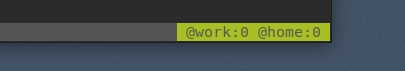

# Tmux `notmuch` counter

Plugin that counts files on a specific `notmuch` searches.

If you use [notmuch](https://notmuchmail.org/) to tag and organize you can use
this plugin to count emails using any `notmuch` search and display the results
in your tmux left or right status bar.

This shows how many unread emails I have in both my personal and work
accounts: 

This plugin is very much copied from
[tmux-maildir-counter](https://github.com/tmux-plugins/tmux-maildir-counter).


### Usage

Add the list of searches you want to count to your `tmux.conf`. Different
searches must be separated by `|`.

```tmux.conf
set -g  @notmuch_searches 'tag:inbox and tag:unread|tag:bulk and date:1_week..'
```

Then, add `notmuch_N` to your left/right status bar where `N` is the index of
the folder you want to show.

```tmux.conf
set -g status-right ' @work:#{notmuch_1} @home:#{notmuch_2} '
```

You can specify a `notmuch` configuration by placing it before a `;`. It can
handle `~/` and `$HOME` shortcuts.

```tmux.conf
set -g  @notmuch_searches  '~/.notmuch-work-config;tag:inbox and tag:unread'
set -ga @notmuch_searches '|~/.notmuch-home-config;tag:inbox and tag:unread'
```


### Installation with Tmux Plugin Manager (recommended)

Add plugin to the list of TPM plugins:

```tmux.conf
set -g @plugin 'twrecked/tmux-notmuch-counter'
```

Press prefix + I to install it.


### Manual Installation

Clone the repo:

```bash
$ git clone https://github.com/twrecked/tmux-notmuch-counter ~/clone/path
```

Add this line to your .tmux.conf:

```tmux.conf
run-shell ~/clone/path/tmux-notmuch-counter.tmux
```

Reload TMUX environment with:

```bash
$ tmux source-file ~/.tmux.conf
```

### License

[MIT](LICENSE)
